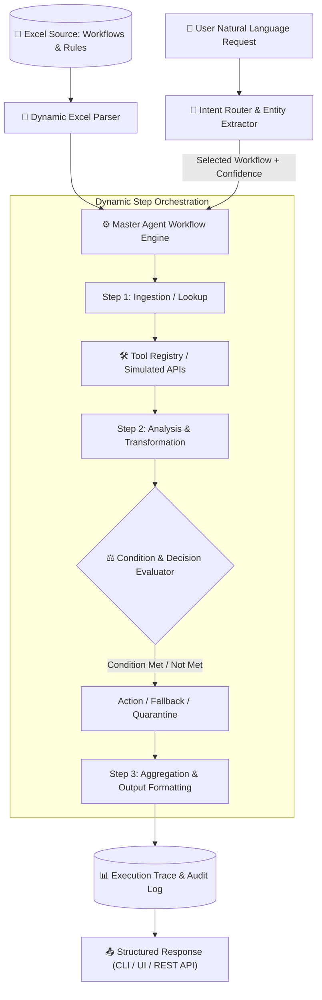

# ⚡ AI Agent Business Workflow Automation System

[](https://www.python.org/downloads/)
[](https://pytest.org)
[](https://fastapi.tiangolo.com)
[](https://streamlit.io)
[](https://opensource.org/licenses/MIT)

An enterprise-grade, extensible AI Agent Workflow Orchestration system designed to dynamically parse, route, execute, and audit business workflows defined in Excel spreadsheets.

---

## 📑 Table of Contents
- [Architecture & Design Decisions](#-architecture--design-decisions)
- [All 10 Implemented Workflows](#-all-10-implemented-workflows)
- [Extensibility (Adding an 11th Workflow)](#-extensibility-adding-an-11th-workflow)
- [Project Directory Structure](#-project-directory-structure)
- [Installation & Quickstart](#-installation--quickstart)
- [Running the Application](#-running-the-application)
  - [1. Streamlit Web Dashboard](#1-interactive-streamlit-web-dashboard)
  - [2. Rich Command Line Interface (CLI)](#2-rich-terminal-cli)
  - [3. FastAPI REST Server](#3-fastapi-rest-api-server)
- [Testing & Benchmark Scorecard](#-testing--benchmark-scorecard)
- [Loom Video Walkthrough](#-loom-video-walkthrough)

---

## 🏗️ Architecture & Design Decisions

### Why Not 10 Hardcoded Chatbots?
Traditional chatbots rely on hardcoded `if-elif` logic or separate agent prompts. This architecture uses a **Dynamic Decoupled Agent Pattern**:
1. **Excel as the Source of Truth:** Workflows and evaluation rules are parsed dynamically from `data/AI_Agent_Workflow_Assessment.xlsx`.
2. **Modular Tool Registry:** Domain tools and simulated APIs are registered with standard signatures using `@register_tool`.
3. **Multi-Strategy Intent Router:** Maps natural language requests to workflows using semantic similarity, entity extraction, and discriminative intent weighting (with optional LLM reasoning).
4. **Deterministic Decision & Condition Engine:** Enforces business logic (e.g. thresholds, zero-hallucination policies, missing data quarantines).
5. **Full Execution Tracing:** Every execution produces structured telemetry (steps, timings, decisions evaluated, tool inputs/outputs).



---

## 📋 All 10 Implemented Workflows

All 10 workflows from the assessment sheet are implemented, tested, and fully functional:

| ID | Workflow Name | Trigger Description | Key Tools Used | Decision Logic Enforced |
|---|---|---|---|---|
| **WF001** | **Inventory Restock Check** | User asks which products need restocking | `read_inventory_csv`, `calculate_stock_restock` | If `current_stock < minimum_stock`, calculate shortage and reorder budget. |
| **WF002** | **Product Price Validation** | User asks to validate product prices | `read_vendor_prices_csv`, `calculate_price_variance` | Flag products where price difference exceeds 10% tolerance. |
| **WF003** | **Vendor File Processing** | User provides a vendor file for processing | `ingest_and_clean_vendor_file` | Rows missing `SKU` or `product_name` are quarantined with failure audit. |
| **WF004** | **Product Description Generator** | User asks to generate product content | `generate_product_content` | **Zero-Hallucination:** Unprovided attributes are explicitly tagged with `[Not Specified]`. |
| **WF005** | **Customer Order Status** | User asks for order status (e.g. `ORD-1001`) | `lookup_order_and_shipment` | Searches orders & tracking; if not found, prompts user for valid identifier. |
| **WF006** | **Duplicate Product Detection** | User asks to find duplicate products | `read_product_catalog_csv`, `detect_duplicate_products` | Exact SKU match = 100% collision; fuzzy text match = high similarity cluster. |
| **WF007** | **Marketing Campaign Brief** | User asks to create a campaign brief | `generate_campaign_brief` | Validates goals & dates; generates channel breakdown and pre-launch checklist. |
| **WF008** | **SEO Keyword Classification** | User uploads/provides keyword list | `read_seo_keywords_csv`, `classify_and_map_keywords` | Deduplicates and classifies into 4 search intents (Informational, Commercial, Transactional, Navigational). |
| **WF009** | **Employee Task Assignment** | Manager asks agent to assign a task | `assign_employee_task` | Scores candidate skills vs available capacity; escalates if no match found. |
| **WF010** | **Workflow Performance Report** | User asks for a performance report | `read_execution_logs_csv`, `analyze_workflow_performance` | Flags workflows with failure rate > 10% or latency > 5.0s with recommendations. |

---

## ⚡ Extensibility (Adding an 11th Workflow)

Adding an 11th workflow requires **zero code changes** to the core engine. You can either:
1. **Option A (Excel Sheet):** Add a row in `data/AI_Agent_Workflow_Assessment.xlsx` under the `Workflows` sheet.
2. **Option B (Programmatic / UI):** Register a `WorkflowDefinition` object via Python or the Streamlit UI.

### Extensibility Demonstration
Run the standalone demo script:
```bash
python examples/add_11th_workflow_demo.py
```

```python
from src.core.engine import WorkflowEngine
from src.core.models import WorkflowDefinition

engine = WorkflowEngine()

# Register Workflow 11
wf11 = WorkflowDefinition(
    workflow_id="WF011",
    workflow_name="Customer Refund Request Processing",
    trigger="User requests a refund or payment dispute for an order",
    inputs="Customer Order ID; refund reason; purchase date",
    steps_raw="Verify order eligibility → check return window policy → calculate refund amount → submit transaction",
    decision_logic="If purchase was made within 30 days and item is undamaged, approve refund; otherwise escalate",
    tools_required="Payment gateway API; policy checker",
    expected_output="Refund approval status, transaction ID, and customer notification"
)
engine.register_custom_workflow(wf11)

# Execute query against new workflow
trace = engine.execute("Customer requesting a refund on order ORD-1001 within 14 days")
print(trace.selected_workflow_id)  # Returns: WF011
```

---

## 📂 Project Directory Structure

```text
ai-agent-workflow-automation/
├── data/
│   ├── AI_Agent_Workflow_Assessment.xlsx  # Original Excel workflow definitions
│   ├── sample_execution_traces.json       # Exported execution trace benchmarks
│   ├── generate_mock_data.py             # Realistic mock data generator script
│   └── mock_sources/                     # Simulated business databases & CSVs
│       ├── inventory.csv
│       ├── vendor_prices.csv
│       ├── vendor_raw_sample.csv
│       ├── vendor_raw_sample.xlsx
│       ├── orders.json
│       ├── products_catalog.csv
│       ├── seo_keywords.csv
│       ├── employees.json
│       └── workflow_execution_logs.csv
├── src/
│   ├── core/                             # Core orchestration engine
│   │   ├── models.py                     # Pydantic data structures & traces
│   │   ├── excel_parser.py               # Dynamic Excel loader
│   │   ├── tool_registry.py              # Extensible tool registration & runner
│   │   ├── intent_router.py              # Intelligent semantic & keyword router
│   │   └── engine.py                     # Master Agent Workflow Engine
│   ├── tools/                            # Modular atomic business tools
│   │   ├── csv_data_tools.py
│   │   ├── calculator_tools.py
│   │   ├── data_cleaning_tools.py
│   │   ├── content_generator_tools.py
│   │   ├── order_tools.py
│   │   ├── deduplication_tools.py
│   │   ├── campaign_tools.py
│   │   ├── seo_tools.py
│   │   ├── employee_tools.py
│   │   └── analytics_tools.py
│   ├── ui/
│   │   └── app.py                        # Streamlit web interface
│   ├── api/
│   │   └── server.py                     # FastAPI REST server
│   └── main.py                           # Rich CLI application
├── tests/
│   └── test_all_workflows.py             # 22 automated PyTest test cases
├── examples/
│   └── add_11th_workflow_demo.py         # Extensibility tutorial script
├── LOOM_WALKTHROUGH.md                   # Loom video script & talking points
├── requirements.txt                      # Project dependencies
├── .env.example                          # Environment variable template
└── README.md                             # Project documentation
```

---

## 🚀 Installation & Quickstart Guide

### 📋 Prerequisites
- **Python 3.10, 3.11, or 3.12** installed on your system.
- **Git** installed.
- *(Optional)* OpenAI, Groq, or Anthropic API key if you wish to use remote LLMs (the system runs 100% offline out-of-the-box using the deterministic hybrid engine).

---

### 1️⃣ Clone the Repository
```bash
git clone https://github.com/SubhadeepBhadra/ai-agent-workflow-automation.git
cd ai-agent-workflow-automation
```

---

### 2️⃣ Create & Activate Virtual Environment

**On Windows (PowerShell):**
```powershell
python -m venv venv
.\venv\Scripts\Activate.ps1
```

**On Windows (Command Prompt - CMD):**
```cmd
python -m venv venv
venv\Scripts\activate.bat
```

**On macOS & Linux:**
```bash
python3 -m venv venv
source venv/bin/activate
```

---

### 3️⃣ Install Dependencies
```bash
python -m pip install --upgrade pip
python -m pip install -r requirements.txt
```

---

### 4️⃣ Environment Configuration (Optional)
If you want to configure custom data paths or enable cloud LLM providers (e.g. OpenAI / Groq), copy the sample environment file:

**On Windows (PowerShell):**
```powershell
Copy-Item .env.example .env
```

**On macOS / Linux / Bash:**
```bash
cp .env.example .env
```
*(Open `.env` and enter your API keys if desired; otherwise, leave as default for local hybrid execution).*

---

### 5️⃣ Verify Installation (Quick Health Check)
Run the automated test suite to verify that all components, workflows, and tools are operating properly:
```bash
python -m pytest tests/test_all_workflows.py -v
```
*Expected: `22 passed in < 1.0s`*

---

## 🖥️ Running the Application

### 🌐 1. Interactive Streamlit Web Dashboard (Recommended)
Launch the graphical interface to interactively test queries, view step execution traces, inspect source data, and build dynamic workflows:
```bash
python -m streamlit run src/ui/app.py
```
👉 Open your browser at **`http://localhost:8501`**

---

### 💻 2. Rich Terminal CLI
You can run the agent in multiple CLI modes directly from your terminal:

```bash
# 1. Run full 10/10 automated benchmark suite across all Excel workflows
python src/main.py --test-all

# 2. Execute a single natural language business query
python src/main.py --request "Which products need restocking?"
python src/main.py --request "Where is order ORD-1001?"
python src/main.py --request "Find products where vendor price differs by more than 10%."

# 3. Demonstrate 11th workflow extensibility (Zero core engine code changes)
python src/main.py --demo-extensibility

# 4. List all workflows loaded dynamically from Excel
python src/main.py --list-workflows

# 5. Interactive Chat REPL mode
python src/main.py
```

---

### 🔌 3. FastAPI Production REST API Server
Start the REST API server for programmatic integration:
```bash
python -m uvicorn src.api.server:app --host 127.0.0.1 --port 8000 --reload
```
- **REST API Base URL:** `http://localhost:8000`
- **Interactive Swagger Docs:** `http://localhost:8000/docs`
- **Alternative ReDoc:** `http://localhost:8000/redoc`

#### Quick API Test with cURL:
```bash
curl -X POST "http://127.0.0.1:8000/api/execute" \
     -H "Content-Type: application/json" \
     -d "{\"user_request\": \"Which products need restocking?\"}"
```

---

## 🧪 Testing & Benchmark Scorecard

Run the full automated test suite covering all 10 workflows, decision conditions, and extensibility:
```bash
pytest tests/test_all_workflows.py -v
```

### Benchmark Summary Scorecard
```text
============================= test session starts =============================
tests/test_all_workflows.py::test_excel_loading PASSED                   [  4%]
tests/test_all_workflows.py::test_workflow_test_questions[0] PASSED      [  9%]  # WF001
tests/test_all_workflows.py::test_workflow_test_questions[1] PASSED      [ 13%]  # WF002
tests/test_all_workflows.py::test_workflow_test_questions[2] PASSED      [ 18%]  # WF003
tests/test_all_workflows.py::test_workflow_test_questions[3] PASSED      [ 22%]  # WF004
tests/test_all_workflows.py::test_workflow_test_questions[4] PASSED      [ 27%]  # WF005
tests/test_all_workflows.py::test_workflow_test_questions[5] PASSED      [ 31%]  # WF006
tests/test_all_workflows.py::test_workflow_test_questions[6] PASSED      [ 36%]  # WF007
tests/test_all_workflows.py::test_workflow_test_questions[7] PASSED      [ 40%]  # WF008
tests/test_all_workflows.py::test_workflow_test_questions[8] PASSED      [ 45%]  # WF009
tests/test_all_workflows.py::test_workflow_test_questions[9] PASSED      [ 50%]  # WF010
tests/test_all_workflows.py::test_wf001_inventory_restock PASSED         [ 54%]
tests/test_all_workflows.py::test_wf002_price_validation PASSED          [ 59%]
tests/test_all_workflows.py::test_wf003_vendor_file_processing PASSED    [ 63%]
tests/test_all_workflows.py::test_wf004_product_description_no_hallucination PASSED [ 68%]
tests/test_all_workflows.py::test_wf005_order_status_lookup PASSED       [ 72%]
tests/test_all_workflows.py::test_wf006_duplicate_detection PASSED       [ 77%]
tests/test_all_workflows.py::test_wf007_campaign_brief PASSED            [ 81%]
tests/test_all_workflows.py::test_wf008_seo_keywords_classification PASSED [ 86%]
tests/test_all_workflows.py::test_wf009_employee_assignment PASSED       [ 90%]
tests/test_all_workflows.py::test_wf010_workflow_performance_report PASSED [ 95%]
tests/test_all_workflows.py::test_extensibility_11th_workflow PASSED     [100%]

============================= 22 passed in 0.87s ==============================
```
